# Real time web
During this course we will learn how to build a real-time application. We will learn techniques to setup an open connection between the client and the server. This will enable us to send data in real-time both ways, at the same time.

## Streamy-Chan

Experience a unique online platform where you can create your own chat rooms and enjoy group activities with friends. This website lets you start rooms to chat, watch YouTube videos together, and share GIFs to make conversations more enjoyable. Customize your virtual space, engage in lively discussions, and create memorable moments with friends. Join the fun and start your own room today!

**Big screens**

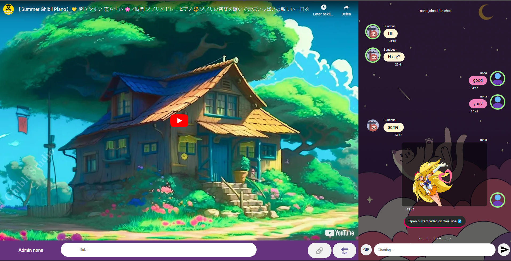

**Small screens**

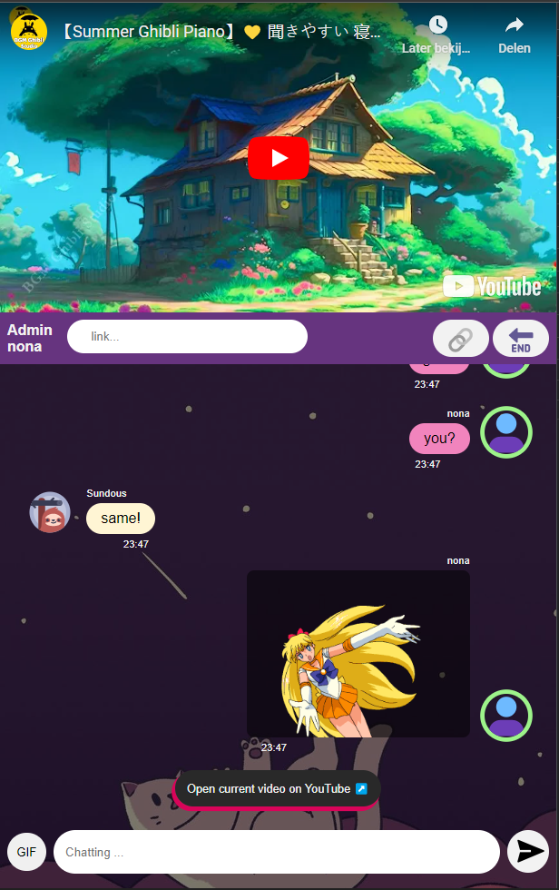

## 🛠️ Features Combined 

- Open a private room ✅
- No other person can open a room in the same room ✅
- username choosing  ✅
- Can choose a avatar foto (from standard list) ✅
- Members cannot have the same names in a single chat ✅
- The member who opens the room is the admin (the first to join the chat) ✅
- If the admin leaves, the next joiner becomes the admin ✅
- Chat together ✅
- Send GIFs ✅
- Watch videos from YouTube collectively ✅
- See new joiners ✅
- See connection status ✅
- See the name busy writing ✅
- Day and night mode depending on the device mode ✅
- Share the video link in the chat when it is sent to everyone ✅
- New joiners can get chat history ✅
- When joining with the same name, when reconnecting, the member's messages are displayed in the same direction as him ✅
- Include the time the message was sent (not in the chat history) ✅
- When all room members leave, the room is deleted from the server ✅


## 👁️ Demo Link! 
 
* live demo door [railway.app](https://rtw-groep-production.up.railway.app/)
<!-- * live demo door [aptable.io](https://streamy-chan.adaptable.app) -->

---

## 🖊 Concept 
Streamy-Chan is an app where the users can open their own room and chat with their friends and watch something on youtube or websites by forming a link.


---

## 📖 Job Story 
As a social media user, I want to connect with my faraway friends and family through a secure chatting app, so that I can easily communicate with them and watch videos or listen to music while chatting together.

---

- [Real time web](#real-time-web)
  - [Streamy-Chan](#streamy-chan)
  - [🛠️ Features Combined](#️-features-combined)
  - [👁️ Demo Link!](#️-demo-link)
  - [🖊 Concept](#-concept)
  - [📖 Job Story](#-job-story)
  - [💻 Intallation Guide](#-intallation-guide)
    - [Install nvm](#install-nvm)
    - [Clone repo](#clone-repo)
    - [NPM install](#npm-install)
    - [Start server](#start-server)
  - [💾 Used Technologies](#-used-technologies)
  - [Process](#process)
    - [Getting started with socket.io](#getting-started-with-socketio)
  - [Process](#process-1)
    - [Choosing idea](#choosing-idea)
    - [Sketching](#sketching)
    - [API's](#apis)
  - [MOSCOW methode](#moscow-methode)
    - [Must have](#must-have)
    - [Should have](#should-have)
    - [Could have](#could-have)
    - [Would have but not right now](#would-have-but-not-right-now)
  - [Data modeling](#data-modeling)
    - [Real time events](#real-time-events)
  - [UI Stack \& views](#ui-stack--views)
    - [Online](#online)
    - [Online (error)](#online-error)
    - [Room check loading](#room-check-loading)
    - [Room doesn't exist](#room-doesnt-exist)
    - [Room is open (error)](#room-is-open-error)
    - [Username check (error if the username is not available)](#username-check-error-if-the-username-is-not-available)
    - [Username check (the username is available)](#username-check-the-username-is-available)
    - [start chat loading](#start-chat-loading)
    - [admin view VS client view](#admin-view-vs-client-view)
    - [darck \& light mode](#darck--light-mode)
  - [Sources](#sources)


---

## 💻 Intallation Guide 
### Install nvm
1. To install the server you need node and express. You can do that with nvm. Nvm is package installer where you can install different packages. With this code you can install the latest versions of npm and node in your terminal:
```
nvm install 19.8.1
```

### Clone repo
2. Clone this repository by running:
```
git clone https://github.com/SundousKanaan/RTW-Groep.git
```

### NPM install
3. Install the dependencies by running:
```
npm install 
```

### Start server 
Run the following code to start the server: 
```
node app.js
```

---

## 💾 Used Technologies 
* EJS templating engine
* Express
* Socket.io
* [Gfycat’s API](https://developers.gfycat.com/api/#updating-gfycats) 🔗

---

## Process
### Getting started with socket.io
<details>

1. The first goal is to set up a simple HTML webpage that serves out a form and a list of messages. We’re going to use the Node.JS web framework express to this end. Make sure Node.JS is installed.

```
npm install express@4
```

2. Once it's installed we can create an index.js file that will set up our application.
```js
const express = require('express');
const app = express();
const http = require('http');
const server = http.createServer(app);

app.get('/', (req, res) => {
  res.send('<h1>Hello world</h1>');
});

server.listen(3000, () => {
  console.log('listening on *:3000');
});
```

3. Integrate socket.io 
```
npm install socket.io
```

4. That will install the module and add the dependency to package.json. Now let’s edit index.js to add it:
```js
const express = require('express');
const app = express();
const http = require('http');
const server = http.createServer(app);
const { Server } = require("socket.io");
const io = new Server(server);

app.get('/', (req, res) => {
  res.sendFile(__dirname + '/index.html');
});

io.on('connection', (socket) => {
  console.log('a user connected');
});

server.listen(3000, () => {
  console.log('listening on *:3000');
});
```

5. Add a script tag in your index.ejs file for.
```html
<script src="/socket.io/socket.io.js"></script>
```

7. To see connections and disconnections add this code to your server.js
```js 
io.on('connection', (socket) => {
  console.log('a user connected');
  socket.on('disconnect', () => {
    console.log('user disconnected');
  });
});

``` 

</details>

---

## Process

I started thinking about my concept that I would build and I had 3 ideas:

- Use a free Pokemon API to build the game "Who is this Pokemon?"
- Use a free Harry Potter series API to build a game of guessing the name of the spell by its caption.
- A room to watch videos collectively and chat together
- 
### Choosing idea

The stream room was the most exciting for me, because I watch anime with my friends at the same time, but not collectively in one place, and we have to make a note that we started the episode to start almost together, and this is sometimes bad because we miss direct interactive chat while watching.

### Sketching
<details>

I drew the main pages and the link between them in a simple way, and how it will look between the admin and the regular member

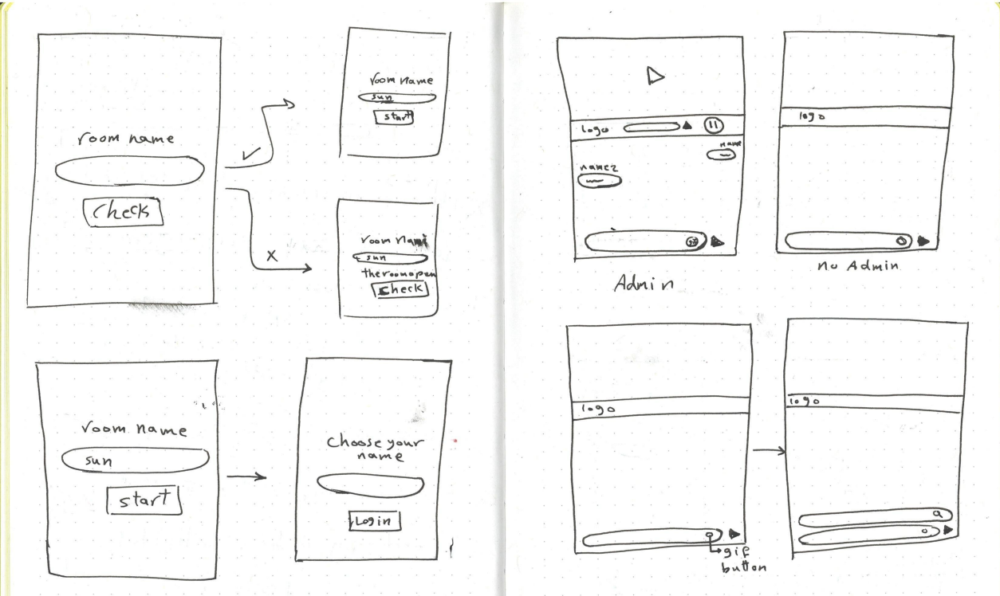
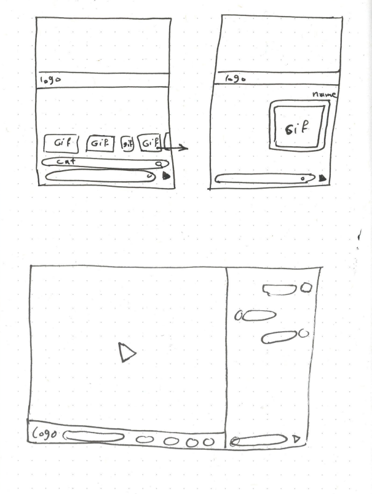

- **App notes**
  * Room state check
  * Admin view is with stream controles
  * Chat users view without stream controles
  * send gif's 
  * mobile view is column but big screens row

</details>

### API's

**API's Features**

<details>

1. YouTube Iframe API
   - Making a special frame for the player through the id of the YouTube link
   - Start the player via a separate button using "play Video() & stopVideo()"

  It also provides data about the video, such as the title of the video and others, but what matters to me is the id of the video.

<details>

```js
//scriptroom.js
const videoFrame = document.getElementById("videoFrame");

let link = '';
let player;
let videoId = '';
let playerLink = videoLinkInput.value;


document.addEventListener("DOMContentLoaded", function () {
  videoLinkInput.addEventListener("keydown", (event) => {
    if (event.keyCode === 13) {
      event.preventDefault();
      videoSendLinkbutton.click();
    }
  });

  videoLinkInput.addEventListener('input', () => {
    if (videoLinkInput.value.trim() === '') {
      videoSendLinkbutton.classList.remove("admin");
    } else {
      videoSendLinkbutton.classList.add("admin");
    }
  })

  function onYouTubeIframeAPIReady(videoUrl) {
    const youtubeUrlRegex = /^(https?:\/\/)?(www\.)?(youtube\.com|youtu\.be)\//;

    if (youtubeUrlRegex.test(videoUrl)) {
      const ytlink = videoUrl.match(/(\?v=|\/embed\/|\/\d\/|\/vi\/|\/v\/|youtu\.be\/|\/e\/|\/watch\?v=|\/watch\?feature=player_embedded&v=|\/watch\?v%3D|^v\=|\/embed\/|youtu\.be\/|\/e\/|watch\?v=|v%3D|youtu\.be\/|embed\/|watch\?v%3D|youtube.com\/user\/[^#]*#([^\/]*\/)*)?([^#\&\?\/]*)/)[3];

      if (videoUrl !== ytlink) {
        if (player) {
          player.destroy();
        }
      }

      let newURL = new URL(videoUrl).pathname;

      const parts = newURL.split("/");
      const videoId = parts[parts.length - 1];

      player = new YT.Player(videoFrame, {
        videoId: videoId,
        playerVars: {
          'playsinline': 1,
          'controls': 0
        },
        events: {
          'onReady': onPlayerReady,
          'onStateChange': onPlayerStateChange
        }
      });

      const liElement = document.createElement("li")
      liElement.classList.add("note")
      liElement.innerHTML = `
      <p><a href="${videoUrl}" target ="blank">Open current video on YouTube ↗️</a></p>
      `
      messages.appendChild(liElement)
      messages.scrollTop = messages.scrollHeight;

    } else {
      videoLinkInput.value = '';
      videoLinkInput.placeholder = "Invalid YouTube URL"
      const liElement = document.createElement("li")
      liElement.classList.add("note")
      liElement.innerHTML = `
      <p><a>Invalid link 💔</a></p>
      `
      messages.appendChild(liElement)
      messages.scrollTop = messages.scrollHeight;
    }
  }

  videoSendLinkbutton.addEventListener("click", () => {
    streamStart.classList.add("admin")
    streamStop.classList.remove('admin')
    videoSendLinkbutton.textContent = "🔁"

    const videoUrl = videoLinkInput.value;

    if (videoUrl.includes("embed")) {
      link = videoUrl + "?controls=0";

      onYouTubeIframeAPIReady(link);

      socket.emit('streamLink', { link, roomID });
    }

    else if (videoUrl.includes("https://www.youtube.com/")) {
      let newURL = new URL(videoUrl);
      let urlSearch = newURL.search;
      let searchID = urlSearch.substring(3);
      let iframeSRC = newURL.origin + "/embed/" + searchID + "?controls=0";
      link = iframeSRC

      onYouTubeIframeAPIReady(link);

      socket.emit('streamLink', { link, roomID });
    }
    else {
      link = videoUrl;

      onYouTubeIframeAPIReady(videoUrl);
      socket.emit('streamLink', { link, roomID });
    }

    onPlayerStateChange(videoUrl);

    socket.emit('stopVideo')
  });

  socket.on("streamLink", (data) => {
    const room = messages.getAttribute("data-room");
    if (data.roomID === room) {
      onYouTubeIframeAPIReady(data.link)
    };
  })

  function onPlayerStateChange() {
    console.log('Player state has changed');
  }

  function onPlayerReady(event) {
    player = event.target;
    streamStart.addEventListener('click', playYTVideo);
    streamStop.addEventListener('click', stopYTVideo);
  }

  function stopYTVideo() {
    streamStart.classList.add("admin")
    streamStop.classList.remove("admin")
    socket.emit('stopStream', roomID);
  }

  function playYTVideo() {
    streamStart.classList.remove("admin")
    streamStop.classList.add("admin")
    socket.emit('startStream', roomID);
  }

  socket.on('startStream', (roomID) => {
    const room = messages.getAttribute("data-room");
    if (roomID === room) {

      player.playVideo();
      player.seekTo(0);
    };
  })

  socket.on('stopStream', (roomID) => {
    const room = messages.getAttribute("data-room");
    if (roomID === room) {
      player.stopVideo();
    };
  })

})
```
  </details>


2. Gfycat API
   - Search in a few different languages
   - jive address
   - GIF image in several different qualities
   Classification of carrion
   - And other data related to carrion
   I used the highest quality gif available and also the gif title

  <details>

```js
// scriptroom.js
gifSearch.addEventListener('click', (event) => {
  event.preventDefault(); // prevent page from reloading

  searchKey = gifInput.value

  // make a fetch request to Giphy API to get a random GIF
  fetch(`https://api.gfycat.com/v1/gfycats/search?search_text=${searchKey}`)
    .then(response => response.json())
    .then(data => {
      // gifList.classList.remove("loadingSearch");
      const urlData = data.gfycats

      for (let i = 0; i < urlData.length; i++) {
        const Gifs = data.gfycats[i].max2mbGif;
        const gifName = data.gfycats[i].title;

        const li = document.createElement("li")
        const button = document.createElement("button")
        const img = document.createElement("img")

        img.src = Gifs;
        img.alt = gifName + " GIF foto";

        button.appendChild(img)
        li.appendChild(button)
        gifList.appendChild(li)
        let avatarsrc;
        for (let i = 0; i < avatarsInput.length; i++) {
          if (avatarsInput[i].checked) {
            let labelChecked = avatarsInput[i].nextElementSibling
            avatarsrc = labelChecked.dataset.avatar
          }
        }

        button.addEventListener('click', (event) => {
          event.preventDefault();
          let currentTimeNL = new Date().toLocaleTimeString('nl-NL', { hour: '2-digit', minute: '2-digit' });

          // send gif data via socket
          const message = {
            gifUrl: Gifs,
            room: roomID,
            userName: usernameInput.value,
            searchKey: searchKey,
            avatar: avatarsrc,
            time: currentTimeNL,
            gifName: gifName
          };

          socket.emit('gifmessage', message);
        });
      }

      if (searchKey === "") {
        gifList.classList.remove('search')
        gifList.classList.remove("loadingSearch");
      }
      else {
        gifList.classList.add('search')
      }

    })
    .catch(error => {
      console.error(error);
    });
});


// receive gif data via socket
socket.on("gifmessage", (msg) => {
  const room = messages.getAttribute("data-room");
  const li = document.createElement("li");
  li.dataset.client = `${msg.userName}`;

  li.innerHTML = `
  <div>
    
  </div>
  <div data-username="${msg.userName}">
  
  </div>
  `

  li.classList.add("time");
  li.dataset.time = `${msg.time}`;

  if (msg.room === room) {
    messages.appendChild(li);
    messages.scrollTop = messages.scrollHeight;
  }

  if (msg.userName === usernameInput.value) {
    li.classList.add("myMessage");
  }

});

```
</details>


</details>

## MOSCOW methode

<details>

### Must have
- Users can create private rooms for their group ✅
- Users can create username ✅
- Users will be placed on a user list ✅
- Admin for each room and he has the controls of the streaming. ✅
- You can see who is online. ✅
- Users can communicate with each other in a group chat. ✅
- Users can watch youtube video together ✅
- Messages are saved ✅
- Data life cycle diagram ✅
  
### Should have
- Instruction how to use the app (zero state)
  - paper sketch ✅
- Must be working on mobile ✅
- Offline support ✅
- responsive app ✅
- light/dark mode (system check) ✅
- Newly joined users can see the chat history ✅ 
  - (Hosting probleem so it may not work properly in the online version now)
- Choose an avatar image ✅
- Notification of the validity of the video link ✅

### Could have
- Users can get a message when the link of the video is good  ✅
- Users can get a message when the link of the video is not good ✅
- Users are notified that someone has been involved ✅
- Users can share GIFs ✅
- 
### Would have but not right now
- wachtwoord de room maken
- Gebruikers kunnen stickers delen
- Streaming websites door hun link
- geluid calls
- video calls
- snel reactions
- dark/light mode door een knop
- Upload an avatar image from the user's device

</details>

## Data modeling

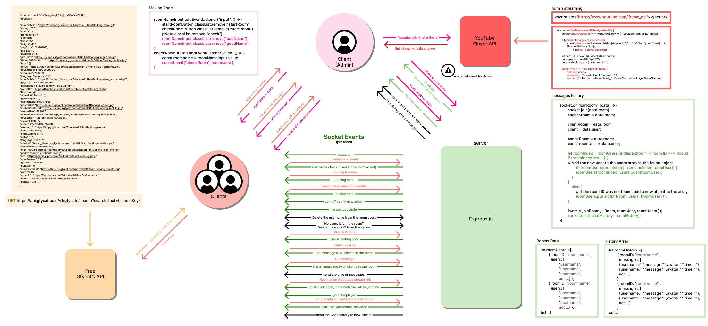

My data lifecycle diagram contains the events that occur during the use of the application and the types of exchanges that occur between users, the server and the associated API's.

### Real time events


<details>

`Connection`

<details>

- Event is executed when the user connects to the server.

- When the user connects to the server, the connection event is triggered. The server sends a message to the client confirming that the user is successfully connected to the server.

```JavaScript
//server.js
io.on('connection', (socket) => {
    console.log('a user connected');
    socket.emit('connection', 'You are connected to the server');

    // Meerder socket events
    socket.on('disconnect', () => {
        console.log('user disconnected');
    });
});
```
</details>

---

`New room`

<details>

- Event is executed when the check room button is pressed.

- When checking that the room name is not in the server's memory, the name is added to the memory and the room is opened.

```JavaScript
// server.js
  socket.on('checkRoom', (roomname) => {
    console.log("openRoomName", roomname);

    let roomIndex = roomUsers.findIndex(room => room.ID === roomname);

    for (const [index, room] of Object.entries(roomUsers)) {
      if (room.ID === roomname) {
        roomIndex = index;
        break;
      }
    }
```
</details>

---

`username check`

<details>

- Event is executed when the user is filling in their username
  
- It is checked directly whether the username is reserved for another person in the room or not, so that the user gets a direct feedback

```js
// server.js
  socket.on('nameCheck', (data) => {
    console.log("nameCheck:", data);
    const client = data.clientName
    const roomId = data.roomID;

    const roomData = roomUsers.find(room => room.ID === roomId);
    if (roomData) {
      const currentRoomUsers = roomData.users
      // console.log("roomData.users",room_users);
      //   console.log("roomData",roomData);
      socket.emit('nameCheck', { client, roomId, currentRoomUsers });
    } else {
      socket.emit('nameCheck', { client, roomId });
      console.log('ID niet gevonden in de array');
    }
  })
```
</details>

---

⚠️`Room admin`

⚠️ A special event to determine the chat admin
<details>

- The event is executed when a new member joins the room and in the offline state.

1. Verification is done when joining the room because the first person to join (in the matrix of room members) is the admin responsible for controlling the video
2. Verification is done in the absence of communication in order to become the next member of the matrix in the admin (since the main admin is considered to have left the chat)
   
```js 
// server.js
  socket.on('roomAdmin', (data) => {
    console.log("roomAdmin", data.roomID);

    const room = roomUsers.find(room => room.ID === data.roomID);
    if (room) {
      // console.log("86 LOL", room); // Geeft een array terug met de gebruikers van de kamer
      io.emit('roomAdmin', {data,room})
    } else {
      console.log("Kamer niet gevonden");
    }

  })

// scriptroom.js
function roomAdmin(roomUsers) {
  const room = roomUsers.find(room => room.ID === roomID);

  const currentAdmin = room.users[0];
  h1.textContent = `Admin ${currentAdmin}`;
  socket.emit("roomAdmin", { currentAdmin, roomID });
}

socket.on("roomAdmin", (roomData) => {
  console.log("roomData", roomData);
  const room = messages.getAttribute("data-room");

  if (roomData.data.roomID === room) {
    if (roomData.room.users[0] === usernameInput.value) {
      videoForm.classList.add("admin");
      // span.classList.add("admin");
    }
  }
})
```
**the admin left the chat**
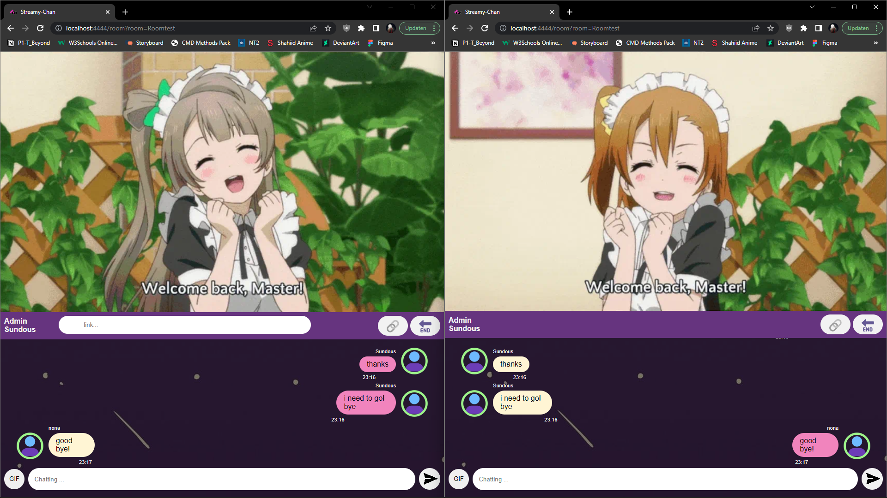

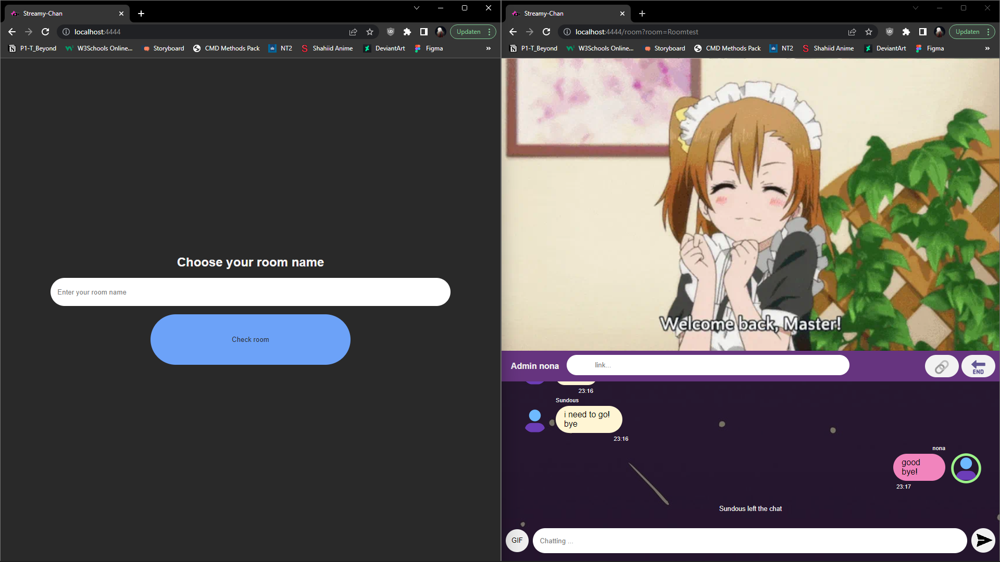

</details>

---

`join Room`

<details>

- Event is executed when it is verified that the user name does not exist in the room, so that it goes directly to the band, and the user is added to the room data inside the server

```js
// server.js
 socket.on('joinRoom', (data) => {
    socket.join(data.room);
    socket.room = data.room;

    // Save username and room for offline event
    clientRoom = data.room;
    client = data.user;

    const Room = data.room;
    const roomUser = data.user;

    let roomIndex = roomUsers.findIndex(room => room.ID === Room);

    if (roomIndex !== -1) {
      // Add the new user to the users array in the found object
      if (!roomUsers[roomIndex].users.includes(roomUser)) {
        roomUsers[roomIndex].users.push(roomUser);
      }
    }
    else {
      // If the room ID was not found, add a new object to the array
      roomUsers.push({ ID: Room, users: [roomUser] });
    }

    io.emit('joinRoom', { Room, roomUser, roomUsers });

    socket.emit('chatHistory', roomHistory);
    console.log("rooms DATA:", roomUsers);
  });

```

**join room note**
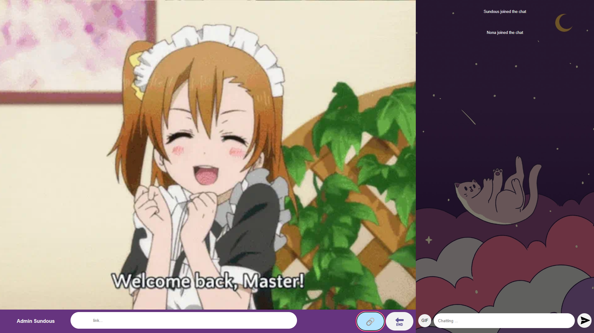
</details>

---

`chat message`

<details>

- The event is executed when a message is sent from the chat via the send message button
- The room data, the text of the message, the time of sending, the user name and the user picture are transferred to the server to be transmitted to all members of the chat.
  
```js
// server.js
  socket.on("chatmessage", (chat) => {
    const room = chat.room;
    const message = chat.message;
    const username = chat.username;
    const avatar = chat.avatar
    const time = chat.time
    console.log("chat message |", time);

    // send the message to all sockets in the room
    io.emit("chatmessage", { username, message, room, avatar, time });
  });

```
</details>

---

`Chat History`

<details>

- The event is executed when a message or GIF is sent from the chat via the Send Messages button
  
- The presence of the room name is checked in chat history or not. If it is found, the message data will be added to the room data, and if it is not, a new element will be created containing the name of the new room and its data
  
```js
// server.js
  socket.on("chatmessage", (chat) => {
    const room = chat.room;
    const message = chat.message;
    const username = chat.username;
    const avatar = chat.avatar
    const time = chat.time
    console.log("chat message |", time);

    // send the message to all sockets in the room
    io.emit("chatmessage", { username, message, room, avatar, time });


    // Zoek de index van de kamer in de roomHistory array
    const roomIndex = roomHistory.findIndex((item) => item.roomID === room);

    if (roomIndex !== -1) {
      // Kamer bestaat al, voeg het bericht toe aan de bestaande kamer
      roomHistory[roomIndex].messages.push({ username, message, avatar, time });
    } else {
      // Kamer bestaat nog niet, voeg een nieuw kamerobject toe aan roomHistory
      roomHistory.push({
        roomID: room,
        messages: [{ username, message, avatar, time }],
      });
    }

    // Optioneel: beperk de grootte van de geschiedenis per kamer
    const roomMessages = roomHistory.find((item) => item.roomID === room).messages;
    if (roomMessages.length > historySize) {
      roomMessages.shift(); // Verwijder het oudste bericht
    }
    console.log("roomHistory:", roomHistory);
  });
```

**chat history**
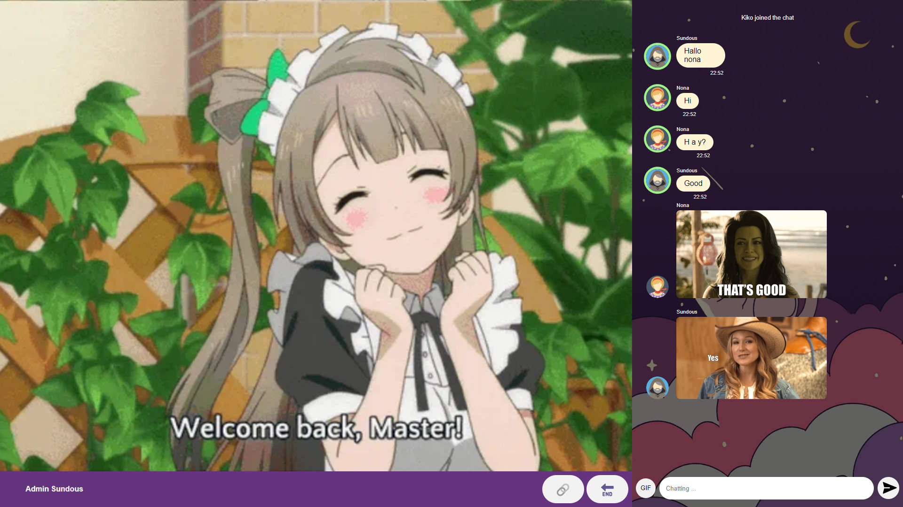
</details>

---

`chat GIF message`

<details>

- The event is executed when a gif message is sent from the chat via the send gif button.
  
- The addition to the chat history is also made

```js 
// server.js
  socket.on('gifmessage', (message) => {
    console.log("Hi:", message)

    const room = message.room;
    const gifMessage = message.gifUrl;
    const searchKey = message.searchKey;
    const userName = message.userName;
    const avatar = message.avatar;
    const time = message.time;
    const gifName = message.gifName;

    io.emit("gifmessage", { gifMessage, room, userName, avatar, time, gifName });

    // Zoek de index van de kamer in de roomHistory array
    const roomIndex = roomHistory.findIndex((item) => item.roomID === room);

    if (roomIndex !== -1) {
      // Kamer bestaat al, voeg het bericht toe aan de bestaande kamer
      roomHistory[roomIndex].messages.push({ userName, gifMessage, avatar, time, gifName });
    } else {
      // Kamer bestaat nog niet, voeg een nieuw kamerobject toe aan roomHistory
      roomHistory.push({
        roomID: room,
        messages: [{ userName, gifMessage, avatar, time, gifName }],
      });
    }

    // Optioneel: beperk de grootte van de geschiedenis per kamer
    const roomMessages = roomHistory.find((item) => item.roomID === room).messages;
    if (roomMessages.length > historySize) {
      roomMessages.shift(); // Verwijder het oudste bericht
    }
    console.log("roomHistory:", roomHistory);
  });
```
</details>

---

⚠️`share stream Link`

⚠️ A special event for the chat admin
<details>

- The event is executed when the YouTube video link is sent to the server to be shared with other chat members

```js
// server.js
  socket.on('streamLink', (data) => {
    const link = data.link;
    const roomID = data.roomID;
    console.log("link", data);
    socket.broadcast.emit('streamLink', { link, roomID });
  })
```
</details>

---

⚠️`start and stop the stream video`

⚠️ A special events for the chat admin

<details>

- The event is executed when the YouTube video link is sent to the server to be shared with other chat members

```js
// server.js
  socket.on('startStream', (roomID) => {
    console.log("startStream", roomID);
    io.emit('startStream', roomID);
  })

  socket.on('stopStream', (data) => {
    io.emit('stopStream', data);
  })
```
</details>

---

`someone writing`

<details>

- The event is executed when a member is writing his message so that all members are notified of his name

```js
// server.js
  socket.on("focus", (data) => {
    socket.broadcast.emit("focus", data);
  });
```

**join room note**

</details>

---

`disconnect`

<details>

- The event is executed when the connection with the server is interrupted, such as exiting the page or interrupting the Internet.

- The custom event is called on the client side to check its connection, to show the connection status note, and to display the chat history when connected to the server.

```js
// server.js
  socket.on("disconnect", () => {
    console.log("user disconnected", client, clientRoom);
    if (client && clientRoom) {
      const roomIndex = roomUsers.findIndex(room => room.ID == clientRoom);
      const userIndex = roomUsers[roomIndex].users.findIndex(user => user == client);
      console.log("disconnect", roomUsers)

      roomUsers[roomIndex].users.splice(userIndex, 1);
      if (roomUsers[roomIndex].users.length == 0) {
        roomUsers.splice(roomIndex, 1);
        console.log(clientRoom, "closed")
      }

      console.log("disconnect 2", roomUsers);
      io.emit('notconnected', { userName: client, roomID: clientRoom, users: roomUsers })
      socket.emit('connected')
    }

  });
```
</details>

</details>

## UI Stack & views

<details>

### Online

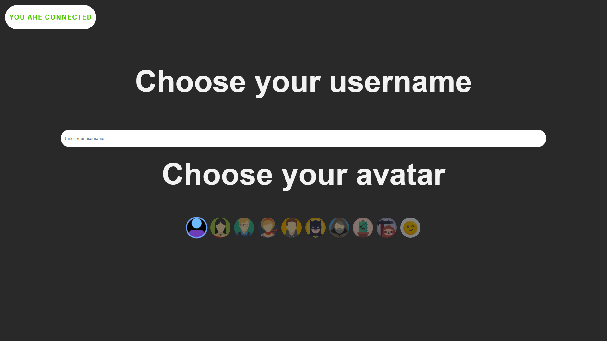

### Online (error)

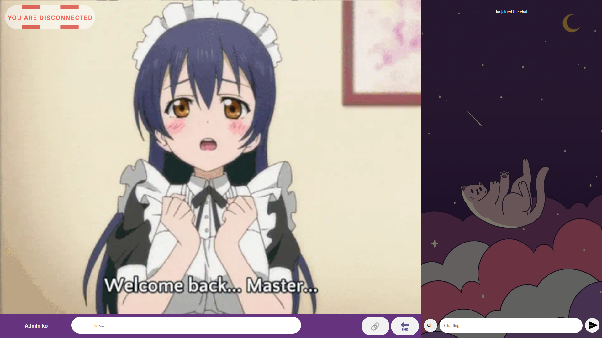


### Room check loading

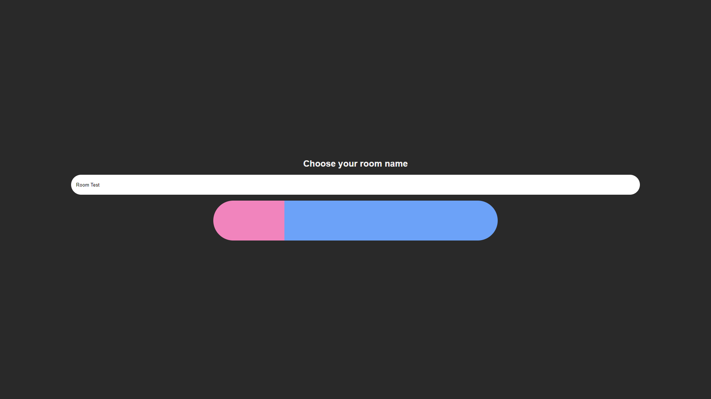

### Room doesn't exist

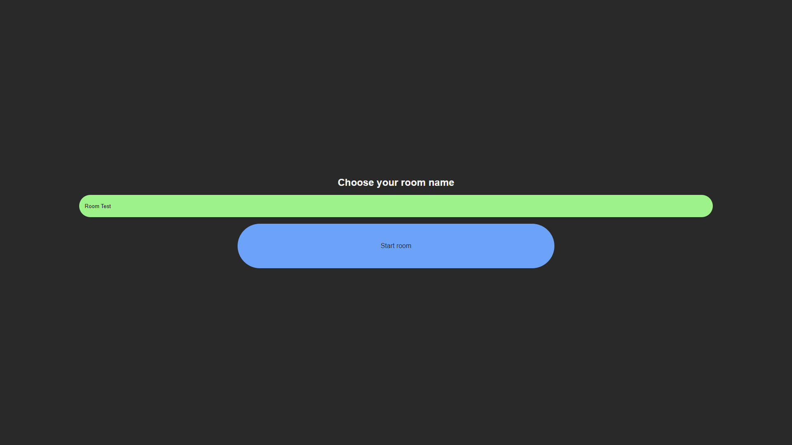

### Room is open (error)

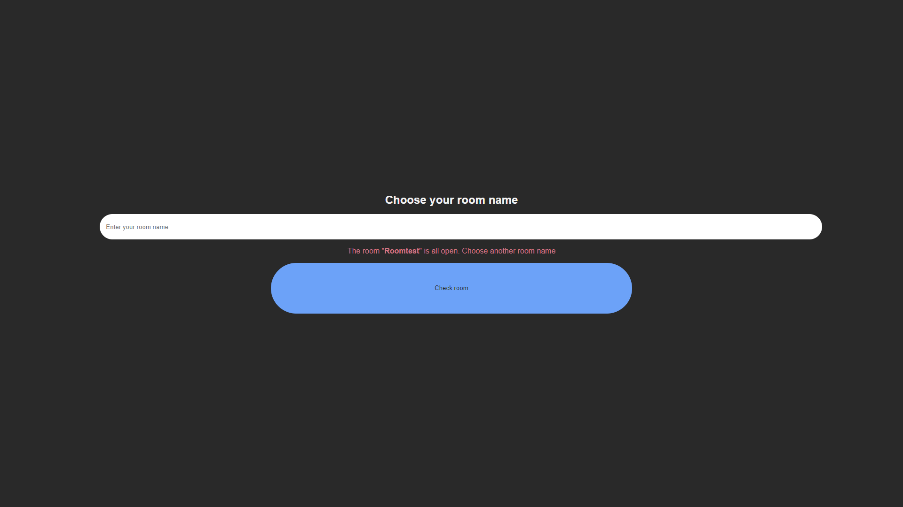

### Username check (error if the username is not available)

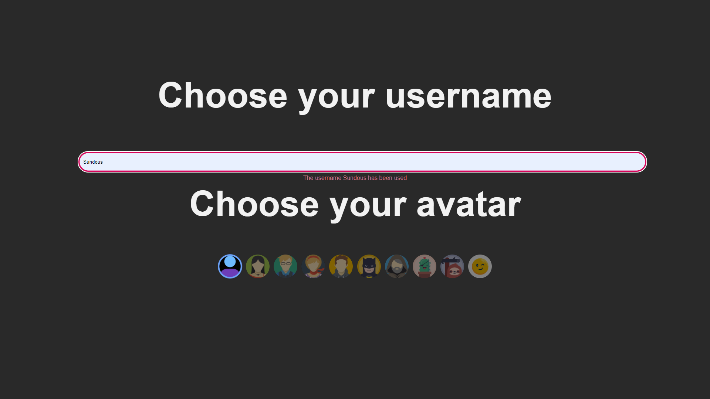

### Username check (the username is available)

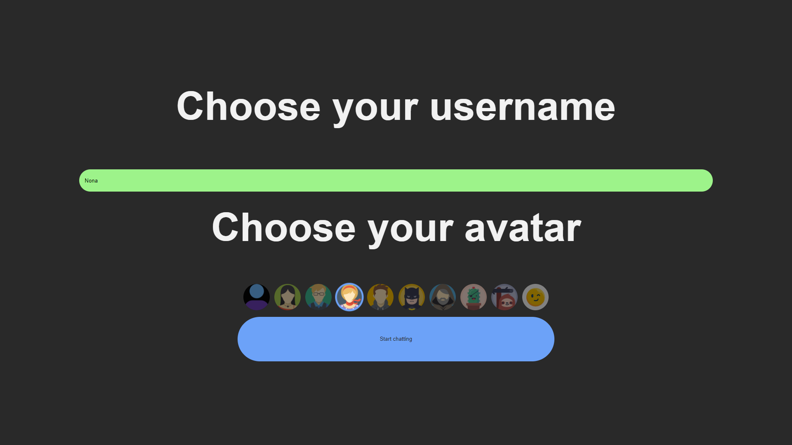

### start chat loading

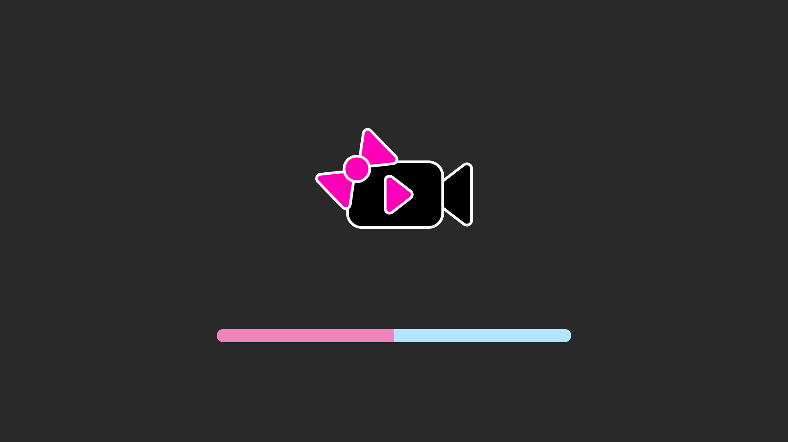


### admin view VS client view

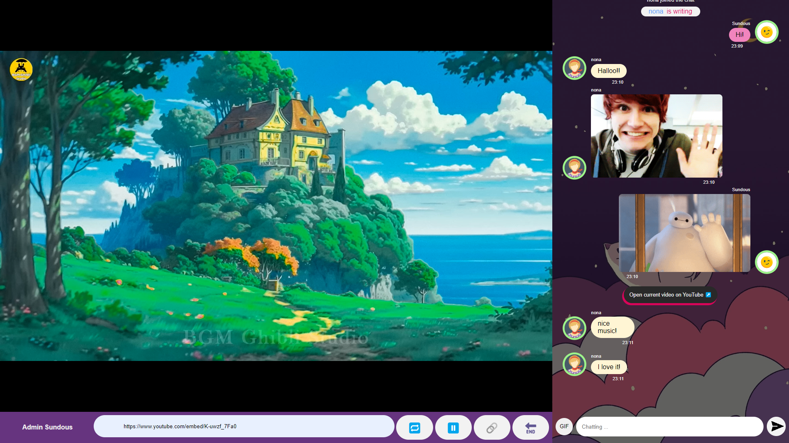


### darck & light mode

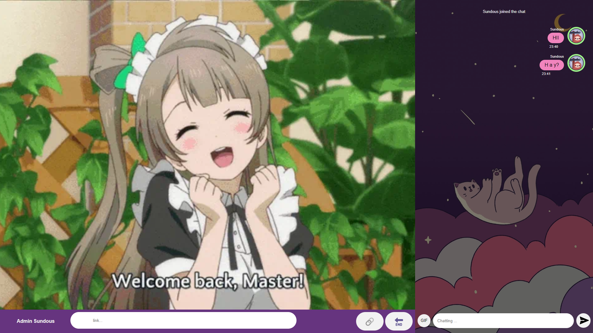

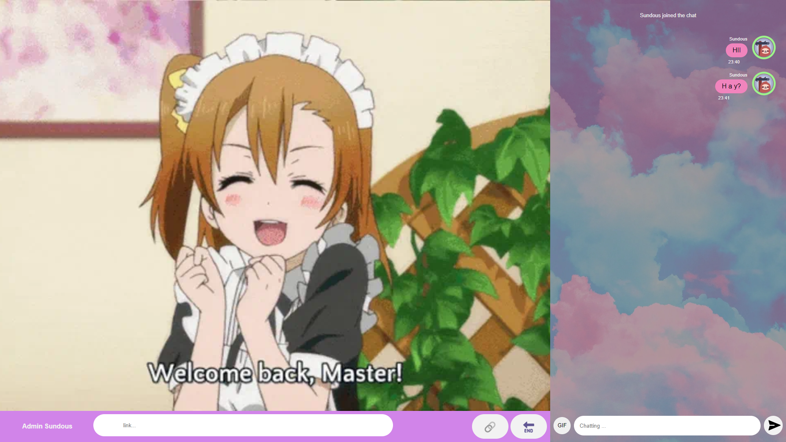

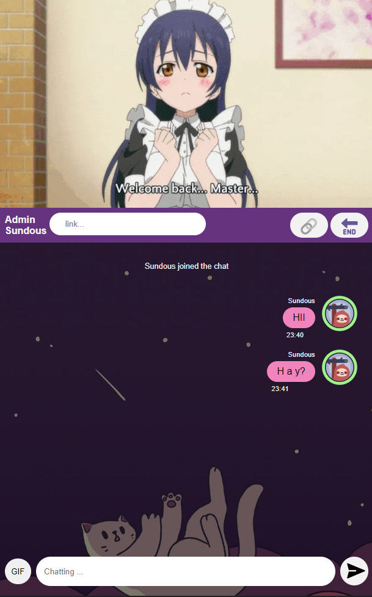

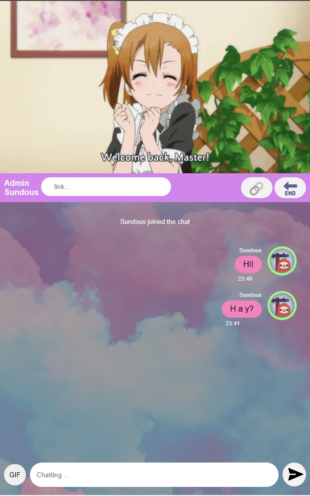


</details>


## Sources
* https://www.npmjs.com/package/nodemon 
* https://fonts.adobe.com/fonts/interstate 
* https://www.git-tower.com/learn/git/faq/git-pull-origin-master
* https://adaptable.io/ 
* https://railway.app/ 
* https://socket.io/get-started/chat/ 


